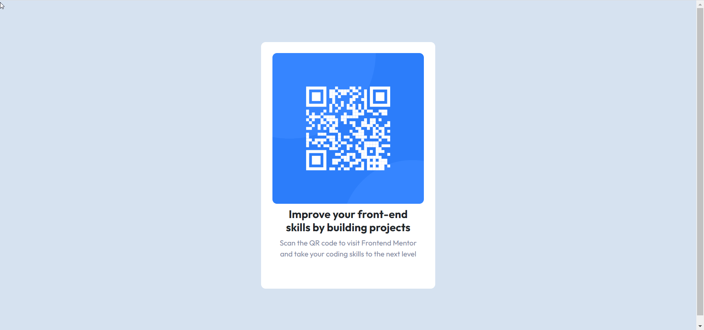

# Frontend Mentor - QR code component solution

This is a solution to the [QR code component challenge on Frontend Mentor](https://www.frontendmentor.io/challenges/qr-code-component-iux_sIO_H). Frontend Mentor challenges help you improve your coding skills by building realistic projects. 

## Table of contents

- [Overview](#overview)
  - [Screenshot](#screenshot)
  - [Links](#links)
  - [Useful resources](#useful-resources)
  - [Author](#author)

## Overview
-this is QR simple challenge in frontend mentor website

### Screenshot

### Links

- Solution URL:(https://github.com/norhanmansour/QRchallenge)
- Live Site URL:(https://your-live-site-url.com)

### Built with

- Semantic HTML5 markup
- CSS custom properties
- Flexbox
- Mobile-first workflow
- (https://getbootstrap.com/) - For styles

## Author

- Website -(https://github.com/norhanmansour)
- Frontend Mentor -(https://www.frontendmentor.io/profile/norhanmansour)

